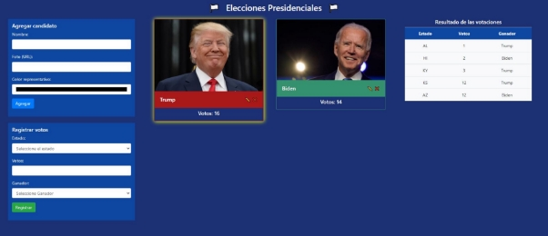

**Prueba - Elecciones presidenciales**

- Para realizar esta prueba debes haber estudiado previamente todo el material disponible en el LMS correspondiente al módulo.
- Desarrollo prueba:
- La prueba se debe desarrollar de manera Individual.
- Para la realización de la prueba necesitarás apoyarte del archivo _Apoyo Prueba - Elecciones presidenciales._

Descripción

En Estados Unidos se celebran elecciones presidenciales cada 4 años y el sistema de votaciones que rige quien es el candidato presidencial está basado en la suma de las votaciones de los colegios electorales de cada estado. En esta prueba deberás desarrollar el backend de un sistema de votaciones electrónico, en donde se registran las votaciones totales por cada estado.

El servidor que construirás deberá permitir a través de diferentes rutas cumplir con los siguientes objetivos:

- Registrar un nuevo candidato
- Obtener los datos de todos los candidatos registrados
- Eliminar un candidato
- Editar la información de un candidato
- Insertar un nuevo registro en un historial de votos
- Devolver todo el historial de votos

En la sección de contenidos encontrarás un **Apoyo Prueba - Elecciones presidenciales** con el index.html correspondiente a la aplicación cliente. No obstante,siéntete libre de modificar la interfaz o crear tu propia maqueta,siempre y cuando cumpla con los requisitos y continúe la temática planteada

En la siguientes imágenes puedes observar la interfaz de la aplicación creada en el lado del cliente:

Imagen 1. Interfaz Inicial. Fuente: Desafío Latam.

Imagen 2. Editar un candidato. Fuente: Desafío Latam.

Imagen 3. Agregar un nuevo candidato. Fuente: Desafío Latam.

Imagen 4. Registrar votos. Fuente: Desafío Latam.

Imagen 5. Resultado de las votaciones. Fuente: Desafío Latam.

Ocupa las siguiente sentencias SQL antes de iniciar el desarrollo de esta prueba para la creación de la base de datos y las tablas que utilizarás para almacenar los datos de la prueba:

**CREATE DATABASE** elecciones

**CREATE TABLE** candidatos (**id** SERIAL, nombre VARCHAR(50), foto varchar(200), color varchar(9), votos INT);

**CREATE TABLE** historial (estado varchar(35) **UNIQUE**, votos INT, ganador varchar(40));

Requerimientos

1. Crear una ruta **POST /candidato** que reciba y procese un payload enviado desde el cliente con el nombre, foto y color representativo del candidato que se desea agregar. Esta ruta deberá activar una función asíncrona,que inserte con una consulta SQL con texto parametrizado un registro a la tabla **candidatos**.
1. Crear una ruta **GET /candidatos** que al ser consultada ejecute una función asíncrona para obtener todos los registros de la tabla **candidatos**,a través de una consulta SQL.
1. Crear una ruta **DELETE /candidato** que reciba como parámetro (query string) el id de un candidato y ejecute una función asíncrona para eliminar el registro de ese candidato en la tabla **candidatos**.
1. Crear una ruta **PUT /candidato** que reciba un payload enviado desde el cliente con el nombre, foto y id de un candidato y ejecute una función asíncrona para actualizar los datos de este candidato en la tabla **candidatos**, a través de una consulta SQL con texto parametrizado.
1. Crear una ruta **POST /votos** que:

- Reciba y procese un payload enviado desde el cliente con el nombre del estado, cantidad de votos y el nombre del candidato ganador.
- Ejecute una función asíncrona que emita una transacción SQLpara actualizar la cantidad de votos del candidato ganador e inserte los datos recibidos en la tabla **historial**.
- En caso de suceder algún conflicto en la transacción, devolver un error de estado HTTP número 500 al cliente.

6. Crear una ruta **GET /historial** que al ser consultada ejecute una función asíncrona para obtener todos los registros de la tabla **historial** a través de una consulta SQL. Se debe devolver al cliente los datos en formato de arreglo.
7. Desarrollar las funciones asíncronas y la lógica que utiliza el paquete pg en un archivo externo al del servidor.

www.desafiolatam.com
